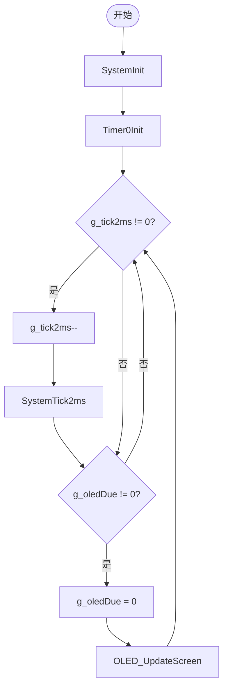
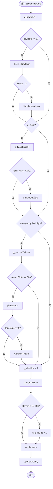
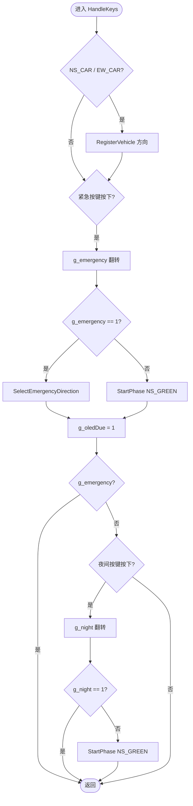
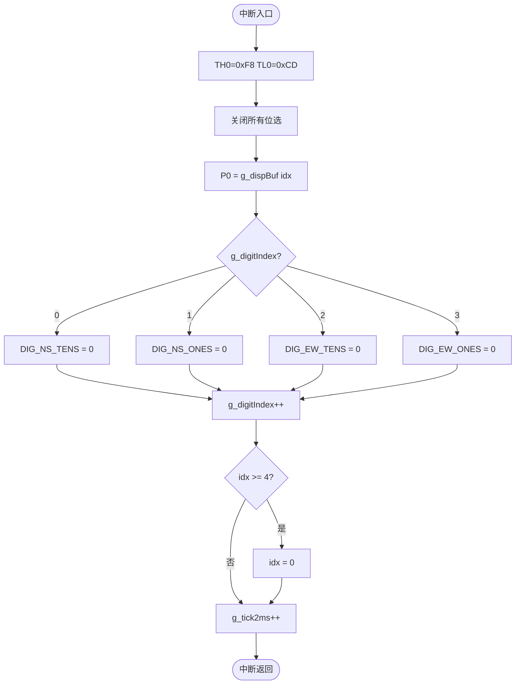
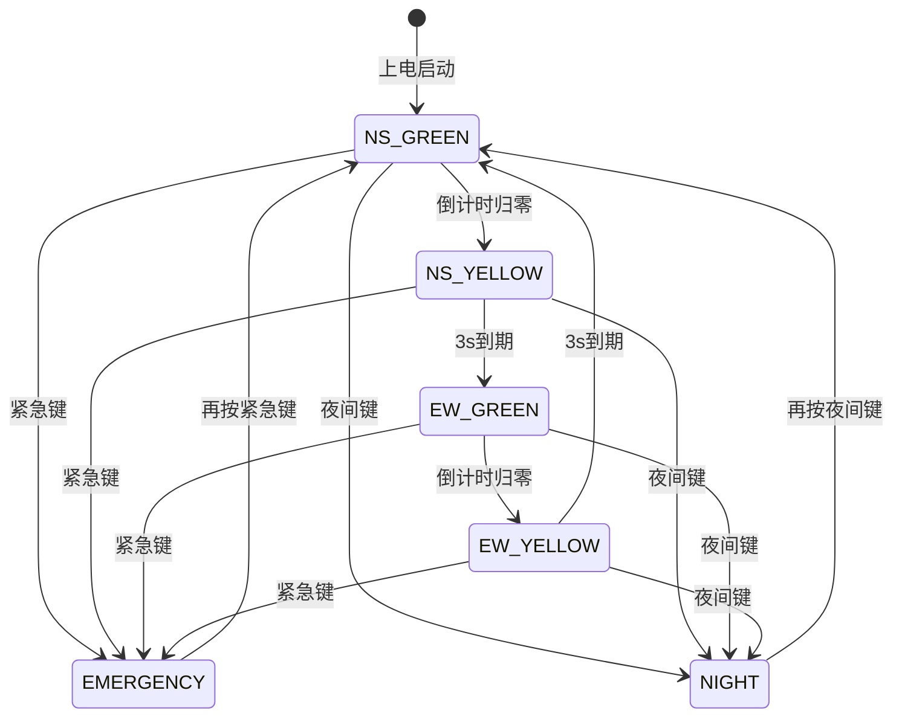
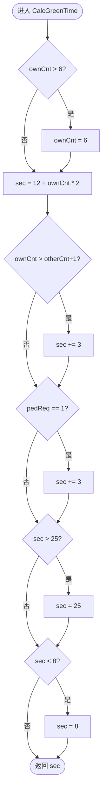

# 软件流程图（Mermaid 版）

## 图一：主程序流程 (main)



---

## 图二：系统 2ms 时基处理 (SystemTick2ms)



---

## 图三：按键处理 (HandleKeys)



---

## 图四：定时器 0 中断服务 (Timer0ISR)



---

## 图五：交通灯状态机



---

## 图六：智能绿灯时间计算 (CalcGreenTime)



---

## 图七：按键消抖流程

```mermaid
flowchart TD
    A([进入 KeyScan]) --> B[读取 raw = KeyReadRaw]
    B --> C[i = 0]
    C --> D{cur == prev?}
    D -- 是 --> E[debounce++]
    E --> F{debounce >= 3?}
    F -- 是 --> G[stable = cur]
    F -- 否 --> H[cur = raw bit i]
    G --> H
    D -- 否 --> I[debounce = 0]
    I --> H
    H --> J{prev==0 且 stable!=0?}
    J -- 是 --> K[edge |= mask]
    J -- 否 --> L{i++}
    K --> L
    L --> M{i < 6?}
    M -- 是 --> D
    M -- 否 --> N([返回 edge])
```
