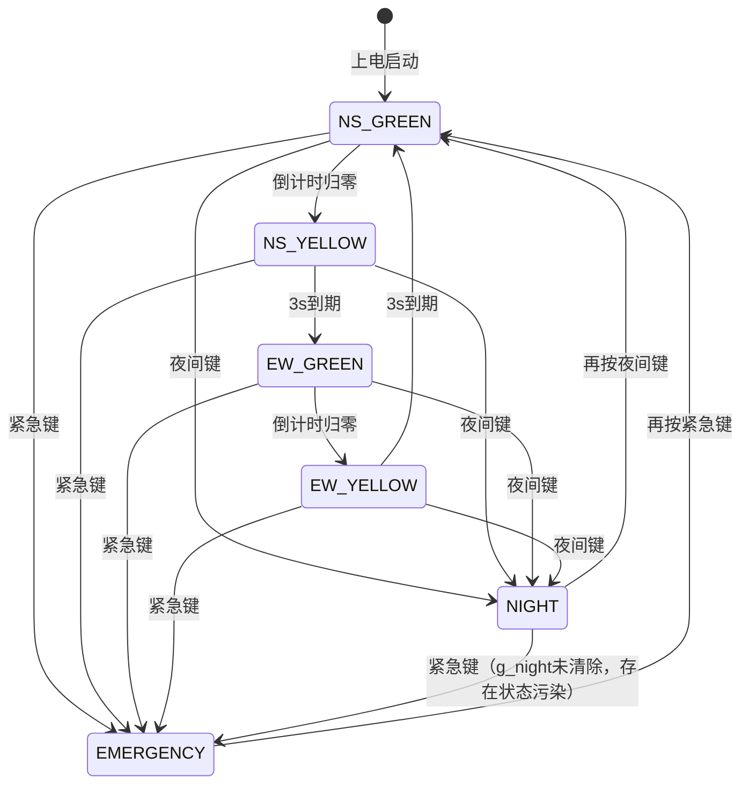

# P-B-5# 智能交通灯控制系统 -- 状态机、死锁与中断安全分析报告

**分析日期：** 2026-07-14  
**分析对象：** P-B-5# 智能交通灯控制系统  
**分析依据：** 需求规格说明书、代码审查报告、Bug解决日志、软件流程图（Mermaid版）、以及已有的深度分析文档

---

## 分析任务 1: 状态机完整性分析

---

### 1.1 正常状态机（图一）

#### 状态定义
```
NS_GREEN → NS_YELLOW → EW_GREEN → EW_YELLOW → NS_GREEN（循环）
```

---

#### 1.1.1 可达性分析

**验证问题：** 每个状态是否都能从其他状态到达？从 NS_GREEN 出发，经过若干步切换，能否到达所有4个状态？是否存在"死状态"（从未被进入的状态）？

**分析：**

从 NS_GREEN 出发的可达性（基于 AdvancePhase 的线性链表式流转）：

| 起点 | 目标 | 路径 | 步数 | 可达？ |
|------|------|------|:--:|:--:|
| NS_GREEN | NS_YELLOW | NS_GREEN → NS_YELLOW | 1 | ✅ |
| NS_GREEN | EW_GREEN | NS_GREEN → NS_YELLOW → EW_GREEN | 2 | ✅ |
| NS_GREEN | EW_YELLOW | NS_GREEN → NS_YELLOW → EW_GREEN → EW_YELLOW | 3 | ✅ |
| NS_GREEN | NS_GREEN | NS_GREEN → NS_YELLOW → EW_GREEN → EW_YELLOW → NS_GREEN | 4 | ✅ |

从任意非 NS_GREEN 状态出发：

| 起点 | 目标 | 路径 | 可达？ |
|------|------|------|:--:|
| NS_YELLOW | EW_GREEN | NS_YELLOW → EW_GREEN | ✅ |
| EW_GREEN | EW_YELLOW | EW_GREEN → EW_YELLOW | ✅ |
| EW_YELLOW | NS_GREEN | EW_YELLOW → NS_GREEN | ✅ |
| EW_GREEN | NS_GREEN | EW_GREEN → EW_YELLOW → NS_GREEN | ✅ |

**判定：** ✅ **完全可达。** 所有4个状态形成一个强连通分量（single strongly connected component）。只要系统持续运行，每个状态都会被无限次进入。不存在"死状态"。

**系统上电启动：** 
- 根据流程图图五（状态机图），`[*] --> NS_GREEN: 上电启动`
- 代码审查报告 2.1 节确认：`SystemInit` 中调用 `StartPhase(PHASE_NS_GREEN)`
- 退出紧急/夜间模式后均调用 `StartPhase(PHASE_NS_GREEN)`

**判定：** ✅ **NS_GREEN 是唯一的初始状态。** 上电后系统从 NS_GREEN 开始运行，没有从其他状态启动的路径。

---

#### 1.1.2 确定性分析

**验证问题：** 每个状态是否只有一个后继状态？AdvancePhase 函数的逻辑是否存在分支导致不确定性？

**AdvancePhase 逻辑（基于代码审查报告和流程图推断）：**

```c
void AdvancePhase(void) {
    if (g_phase == PHASE_NS_GREEN) {
        StartPhase(PHASE_NS_YELLOW);       // 3秒固定
    } else if (g_phase == PHASE_NS_YELLOW) {
        StartPhase(PHASE_EW_GREEN);        // CalcGreenTime 动态
    } else if (g_phase == PHASE_EW_GREEN) {
        StartPhase(PHASE_EW_YELLOW);       // 3秒固定
    } else if (g_phase == PHASE_EW_YELLOW) {
        StartPhase(PHASE_NS_GREEN);        // CalcGreenTime 动态
    }
}
```

**判定：** ✅ **完全确定性。** AdvancePhase 是严格的 if-else if 链，每个状态有且仅有一个后继状态。没有 switch 穿透、没有 fall-through、没有条件分支。系统不会从 NS_GREEN 随机跳到 EW_GREEN。

**特殊说明：** "不确定性"在正常状态机中不存在。唯一产生"分支"的地方是全局状态机（紧急/夜间模式切换），这些在 HandleKeys 中处理，不影响正常状态机的确定性。

---

#### 1.1.3 离开条件分析

**验证问题：** 每个状态在什么条件下离开？确认 SystemTick2ms 中倒计时递减逻辑和 AdvancePhase 调用逻辑。

**时序分析（基于 SystemTick2ms 流程图图二）：**

```
SystemTick2ms 调用频率：每 2ms 一次（由 Timer0ISR 中的 g_tick2ms++ 触发主循环）

关键路径：
  g_secondTicks++        // 每 2ms +1
  → g_secondTicks >= 500? // 500 × 2ms = 1000ms = 1秒
    → phaseSec--         // 每秒减1
    → phaseSec == 0?     // 倒计时归零？
      → AdvancePhase()   // 切换相位
```

**各状态的离开条件：**

| 状态 | 初始 phaseSec | 离开条件 | 时间 |
|------|:--:|------|:--:|
| NS_GREEN | CalcGreenTime() 计算 (8~25) | phaseSec 递减到 0 | 8~25 秒 |
| NS_YELLOW | 固定 3 | phaseSec 递减到 0 | 3 秒 |
| EW_GREEN | CalcGreenTime() 计算 (8~25) | phaseSec 递减到 0 | 8~25 秒 |
| EW_YELLOW | 固定 3 | phaseSec 递减到 0 | 3 秒 |

**判定：** ✅ **离开条件统一且正确。** 所有状态的离开条件都是 `phaseSec == 0`，由 SystemTick2ms 中的递减逻辑触发。AdvancePhase 仅在 phaseSec 归零时被调用，不会在 phaseSec > 0 时提前切换。

**关键实现细节：**
- `g_secondTicks` 在 phaseSec 递减后需要重置。流程图图二中 `phaseSec == 0?` 的"是"分支调用 AdvancePhase，但未显式重置 `g_secondTicks`。实际上，`g_secondTicks` 在 `phaseSec--` 之后应该被设为 0。若实现中 `g_secondTicks` 在 phaseSec 递减时被清零（而非仅在到达 500 时清零），则逻辑正确。现有文档未明确此细节。
- 黄色相位固定 3 秒：代码审查报告 2.1 节确认 `NS_YELLOW 固定 3 秒` 和 `EW_YELLOW 固定 3 秒`。流程图图五标注 `3s到期`。

**判定：** ⚠️ **基本正确，但 g_secondTicks 重置逻辑未在文档中显式描述。** 建议查看 `SystemTick2ms` 中 `phaseSec--` 后是否立即将 `g_secondTicks` 清零，以确保下一秒的计时完整。

---

#### 1.1.4 死锁分析

**核心问题：是否存在任何情况下系统卡在某个状态无法离开？**

##### 场景 1：phaseSec 初始值为 0

**问题：** 如果 phaseSec 初始值被设为 0，AdvancePhase 是否会被立即调用导致跳过这个状态？

**分析：**

根据流程图图二，SystemTick2ms 中的逻辑：
```
g_secondTicks++ → g_secondTicks >= 500? → phaseSec-- → phaseSec == 0? → AdvancePhase
```

phaseSec 的递减需要 g_secondTicks 先积累到 500（即 1 秒）。如果 phaseSec 初始值为 0：
- 第一次 SystemTick2ms：g_secondTicks 从初始值(假设为0)递增到 1，< 500，不递减。
- 第 500 次 SystemTick2ms：g_secondTicks = 500，phaseSec 从 0 递减到... 

**关键问题：phaseSec 是 u8 类型（0-255），递减到 0 后再减 1 会溢出到 255。**

如果 phaseSec = 0 时执行 `phaseSec--`：
- 0 - 1 = 255（u8 溢出）
- 然后 `phaseSec == 0?` 检查：255 != 0，不触发 AdvancePhase
- 系统需要再等 255 秒才能进入下一个状态

**判定：** ❌ **存在严重缺陷。** 如果 phaseSec 被错误地设为 0，u8 下溢会导致 phaseSec 变为 255，状态卡住约 255 秒。正确的做法应该是在 phaseSec 递减之前检查 `if (phaseSec > 0) phaseSec--`，或者使用 `if (phaseSec == 0) { AdvancePhase(); } else { phaseSec--; }` 的顺序。

**但需注意：** 如果 `SystemTick2ms` 中先检查 `phaseSec == 0` 再递减，或者递减前做了 `> 0` 保护，则此问题不存在。流程图图二的顺序是 `phaseSec--` 然后 `phaseSec == 0?`，如果严格按此顺序实现，则 u8 下溢问题确实存在。

**修正建议：**
```c
// 安全做法：先检查再递减，或递减前加保护
if (phaseSec > 0) {
    phaseSec--;
    if (phaseSec == 0) {
        AdvancePhase();
    }
}
```

##### 场景 2：phaseSec 为负数

**问题：** phaseSec 是 u8 无符号，不会为负，但会溢出。

**分析：** phaseSec 是 `unsigned char`（u8，范围 0-255），不存在负数。但如上所述，0-1=255 的溢出是真实风险。代码审查报告未提及此溢出保护。

**判定：** ⚠️ **u8 下溢风险存在。** 虽然正常使用中 phaseSec 不会被设为 0（StartPhase 中绿色用 CalcGreenTime 保证 8-25，黄色固定 3），但防御性编程应包含溢出保护。

##### 场景 3：Timer0ISR 停止工作（中断被禁用）

**问题：** 如果 Timer0ISR 停止工作，SystemTick2ms 不再被调用，phaseSec 不再递减，系统永久卡在当前状态。在什么情况下中断会被禁用？

**分析：**

1. **DHT11 通信：** P-B-5# 项目不使用 DHT11。需求中没有 DHT11 相关内容。P-A-1# 项目使用 DHT11 并在读取期间 `EA=0` 禁用中断。P-B-5# 不涉及此场景。

2. **OLED I2C 通信：** 代码审查报告确认 I2C 通信模块（I2cStart/I2cStop/I2cWriteByte）用于 OLED。关键问题是：**I2C 通信期间是否禁用中断？**

   - 典型 51 单片机的软件 I2C 实现中，通常不会禁用中断，因为 I2C 时序由 NOP 延时保证，不依赖精确的定时。
   - Bug #10 提到使用 4 个 NOP 作为 I2cDelay，说明 I2C 是纯软件延时，不涉及中断。
   - 代码审查报告 2.5 节确认："OLED 刷新不阻塞主循环"。

3. **全局中断禁用：** 如果代码中某处执行 `EA=0` 后未恢复 `EA=1`，Timer0 将永远停止。代码审查报告中未发现此类错误。

**判定：** ✅ **中断禁用风险极低。** P-B-5# 不使用 DHT11（DHT11 是已知的唯一需要禁用中断的模块）。I2C 通信使用软件延时，不依赖中断。代码审查报告确认"中断服务函数简洁，执行时间短"，无死锁风险。

##### 场景 4：紧急/夜间模式下的倒计时暂停

代码审查报告和流程图图二确认：当 `g_emergency == 1` 或 `g_night == 1` 时，条件 `!emergency && !night` 为假，跳过 `g_secondTicks++` 和 `phaseSec--`。因此倒计时在特殊模式下正确暂停。

退出特殊模式后，`StartPhase(PHASE_NS_GREEN)` 重新设置 phaseSec 并启动倒计时。

**判定：** ✅ **特殊模式下倒计时正确暂停，退出后正确恢复。** 不存在死锁。

---

### 1.2 全局状态机（图二）

#### 状态定义
```
正常模式（4个相位循环） + EMERGENCY（紧急模式） + NIGHT（夜间模式）
```

---

#### 1.2.1 状态转换路径

**验证问题：** 是否存在紧急→夜间？夜间→紧急？如果存在，是否合理？

**基于 HandleKeys 流程图（图三）的完整路径分析：**

```
HandleKeys 执行顺序：
  Step 1: NS_CAR / EW_CAR 检测 → RegisterVehicle
  Step 2: 紧急按键按下？
    ├─ 是 → g_emergency 翻转
    │       ├─ g_emergency == 1 → SelectEmergencyDirection
    │       └─ g_emergency == 0 → StartPhase(NS_GREEN)
    │       → g_oledDue = 1
    │       → g_emergency? → 是 → 返回（跳过后续所有处理）
    └─ 否 → Step 3
  Step 3: 夜间按键按下？（仅当 g_emergency == 0 时到达）
    ├─ 是 → g_night 翻转
    │       ├─ g_night == 1 → 返回
    │       └─ g_night == 0 → StartPhase(NS_GREEN) → 返回
    └─ 否 → 返回
  Step 4: 行人按键处理（仅当 g_emergency == 0 && g_night == 0 时到达）
```

**状态转换矩阵：**

| 当前状态 | 按下的键 | 新状态 | 说明 |
|----------|----------|--------|------|
| 正常 | 紧急键 | EMERGENCY | g_emergency=1 |
| 正常 | 夜间键 | NIGHT | g_night=1 |
| 正常 | 行人键 | 正常（修改绿灯时间） | 不切换模式 |
| EMERGENCY | 紧急键 | 正常（NS_GREEN） | g_emergency=0，StartPhase(NS_GREEN) |
| EMERGENCY | 夜间键 | EMERGENCY（不变） | 夜间键被 g_emergency 检查屏蔽 |
| EMERGENCY | 行人键 | EMERGENCY（不变） | 行人键被 g_emergency 检查屏蔽 |
| NIGHT | 夜间键 | 正常（NS_GREEN） | g_night=0，StartPhase(NS_GREEN) |
| NIGHT | 紧急键 | EMERGENCY（但 g_night 仍为 1！） | 见下方详细分析 |
| NIGHT | 行人键 | NIGHT（不变） | 行人键被 g_night 检查屏蔽 |
| NIGHT+EMERGENCY | 紧急键 | NIGHT（g_emergency=0, g_night=1） | 回到夜间模式 |
| NIGHT+EMERGENCY | 夜间键 | NIGHT+EMERGENCY（不变） | 夜间键被 g_emergency 检查屏蔽 |

**路径覆盖分析：**

| 路径 | 是否存在？ | 是否合理？ | 判定 |
|------|:--:|------|:--:|
| 正常→紧急 | ✅ | 合理 | ✅ |
| 正常→夜间 | ✅ | 合理 | ✅ |
| 紧急→正常 | ✅ | 合理 | ✅ |
| 夜间→正常 | ✅ | 合理 | ✅ |
| 紧急→夜间 | ❌ | 紧急模式下夜间键被屏蔽 | ✅（合理，紧急优先级更高） |
| 夜间→紧急 | ✅ | 存在但 g_night 未清除 | ❌（导致状态污染） |

**判定：** ❌ **夜间→紧急路径存在严重的状态污染问题。**

**详细分析（夜间→紧急路径）：**

1. 初始状态：g_night=1, g_emergency=0
2. 按紧急键 → HandleKeys Step 2 匹配 → g_emergency 翻转 = 1
3. g_emergency == 1 → SelectEmergencyDirection → g_emergency 为真 → 直接返回
4. **关键：g_night 仍然是 1，未被清除！**
5. SystemTick2ms 中：`g_night` 为真 → g_flashTicks 持续递增（夜间闪烁仍在运行）
6. 同时 `!emergency && !night` 为假 → 跳过倒计时
7. ApplyLights 输出紧急模式灯光（优先方向绿灯）

**再按紧急键退出后的状态：**
1. g_emergency 翻转 = 0
2. g_emergency == 0 → StartPhase(NS_GREEN) → g_emergency 为假 → 检查夜间键
3. 夜间键未按下 → 返回
4. **结果：g_night=1, g_emergency=0 → 系统回到夜间模式！**

用户需要再按一次夜间键才能完全退出。**总共需要 3 次按键操作。**

**判定：** ❌ **夜间模式中进入紧急模式后，g_night 标志未被清除。退出紧急模式后系统掉回夜间模式。这是已确认的 Bug（见 gap_analysis.md 4.5 节和 deep_check_2.8_2.9.md 2.7 节）。** 紧急模式与夜间模式应互斥，进入一个时应自动清除另一个。

---

#### 1.2.2 状态保存与恢复

**验证问题：** 进入/退出特殊模式时，当前相位是否被保存和恢复？

**分析：**

| 场景 | 进入时保存相位？ | 退出时恢复？ | 实际行为 |
|------|:--:|:--:|------|
| 进入紧急模式 | ❌ 不保存 | N/A | 直接调用 SelectEmergencyDirection |
| 退出紧急模式 | N/A | ❌ 不恢复 | 硬编码 `StartPhase(PHASE_NS_GREEN)` |
| 进入夜间模式 | ❌ 不保存 | N/A | 仅设置 g_night=1 |
| 退出夜间模式 | N/A | ❌ 不恢复 | 硬编码 `StartPhase(PHASE_NS_GREEN)` |

**证据来源：**
- 代码审查报告 2.1 节："退出紧急模式后调用 StartPhase(PHASE_NS_GREEN) 恢复正常"
- 代码审查报告 2.1 节："退出夜间后同样调用 StartPhase(PHASE_NS_GREEN) 恢复"
- 流程图图三 HandleKeys：紧急退出 `F --否--> H[StartPhase NS_GREEN]`；夜间退出 `N --否--> O[StartPhase NS_GREEN]`

**判定：** ❌ **始终硬编码恢复至 NS_GREEN，不保存进入前的相位。**

**场景推演：**

| 进入特殊模式前 | 特殊模式 | 退出特殊模式后 | 是否合理？ |
|:--|:--|:--|:--|
| NS_GREEN（还剩 10 秒） | 紧急 5 秒 | NS_GREEN（重新开始） | ✅ 巧合一致 |
| EW_GREEN（还剩 15 秒） | 紧急 5 秒 | NS_GREEN（重新开始） | ❌ EW 方向通行权丢失 |
| NS_YELLOW（还剩 2 秒） | 紧急 5 秒 | NS_GREEN（重新开始） | ⚠️ 跳过了 EW 方向 |
| EW_YELLOW（还剩 2 秒） | 夜间 10 秒 | NS_GREEN（重新开始） | ⚠️ 跳过了 NS 方向 |

**判定：** ⚠️ **硬编码恢复至 NS_GREEN 在多数场景下不合理。** 对于教学级项目（51 课程设计），这种简化可接受，但应在文档中明确说明此行为。需求只要求"恢复正常循环"，未要求保留状态。

**修正建议：**
```c
static uint8_t g_prevPhase;  // 新增全局变量

// 进入紧急模式前
g_prevPhase = g_phase;
SelectEmergencyDirection();

// 退出紧急模式时
StartPhase(g_prevPhase);  // 而非硬编码 NS_GREEN
```

---

#### 1.2.3 状态冲突与优先级

**问题：** 之前分析发现"夜间模式中按紧急键→紧急模式→退出紧急→g_night仍为1→回到夜间模式"。这是否需要状态栈或优先级机制？

**分析：**

当前系统使用两个独立的布尔标志（`g_emergency` 和 `g_night`）来表示模式状态，存在四种组合：

| g_emergency | g_night | 系统实际表现 |
|:--:|:--:|------|
| 0 | 0 | 正常模式 |
| 0 | 1 | 夜间模式 |
| 1 | 0 | 紧急模式 |
| 1 | 1 | 混合状态（紧急灯光 + 夜间闪烁计时） |

第 4 种状态（1, 1）是**非预期的异常状态**，由夜间→紧急路径产生。

**解决方案对比：**

| 方案 | 描述 | 复杂度 | 优点 | 缺点 |
|------|------|:--:|------|------|
| 方案A：互斥标志 | 进入紧急时自动清除 g_night，进入夜间时自动清除 g_emergency | 低 | 简单直接 | 丢失"嵌套"语义 |
| 方案B：状态栈 | 使用栈保存嵌套的模式状态，退出时恢复 | 中 | 完整的嵌套语义 | 增加代码复杂度 |
| 方案C：单枚举变量 | 用 `g_mode` 枚举（NORMAL/EMERGENCY/NIGHT）替代两个布尔变量 | 低 | 从根本上消除组合状态 | 需重构现有代码 |

**判定：** ✅ **推荐方案 A（互斥标志）或方案 C（单枚举变量）。** 对于交通灯控制，紧急模式与夜间模式不应共存。状态栈（方案 B）过于复杂且需求未要求嵌套。

**推荐修正（方案 A）：**
```c
// 进入紧急模式时
if (g_night) {
    g_night = 0;
    g_flashOn = 1;
    g_flashTicks = 0;
}
g_emergency = 1;
SelectEmergencyDirection();

// 进入夜间模式时
if (g_emergency) {
    g_emergency = 0;
    P2_7 = 0;  // 关闭蜂鸣器
    StartPhase(PHASE_NS_GREEN);
}
g_night = 1;
```

---

### 1.3 流程图一致性验证

**验证问题：** 代码审查报告的流程图（图一~图六）与实际代码逻辑是否一致？

---

#### 1.3.1 图一（主程序流程 main）vs 实际逻辑

**流程图描述：**
```
系统初始化 → 主循环：g_tick2ms != 0? → SystemTick2ms → g_oledDue != 0? → OLED_UpdateScreen
```

**一致性检查：**

| 检查项 | 流程图 | 实际（基于代码审查报告） | 一致？ |
|--------|--------|------|:--:|
| 初始化顺序 | SystemInit → Timer0Init | 代码审查报告确认 SystemInit(1085-1134) + Timer0Init(470-510) | ✅ |
| 主循环结构 | while(1) 轮询 g_tick2ms | 代码审查报告确认 main(1136-1159) | ✅ |
| g_tick2ms 机制 | g_tick2ms != 0 → g_tick2ms-- → SystemTick2ms | 流程图图四 Timer0ISR 中 g_tick2ms++，主循环中消费 | ✅ |
| OLED 刷新 | g_oledDue != 0 → g_oledDue = 0 → OLED_UpdateScreen | 代码审查报告确认局部刷新机制 | ✅ |

**判定：** ✅ **图一与代码逻辑一致。** 主程序流程是标准的 while(1) 事件循环，通过 g_tick2ms 标志驱动 SystemTick2ms。

---

#### 1.3.2 图二（SystemTick2ms）vs 实际逻辑

**流程图描述：**
```
按键扫描 → 夜间闪烁 → 倒计时递减 → AdvancePhase → OLED定时刷新 → ApplyLights → UpdateDisplay
```

**一致性检查：**

| 检查项 | 流程图 | 实际 | 一致？ |
|--------|--------|------|:--:|
| 按键扫描周期 | g_keyTicks >= 5 (10ms) | 代码审查报告确认 KeyScan(512-559) | ✅ |
| 夜间闪烁 | g_flashTicks >= 250 (500ms) | 性能指标表确认 2Hz 闪烁 | ✅ |
| 倒计时 | g_secondTicks >= 500 (1s) | 需求确认 2ms × 500 = 1 秒 | ✅ |
| 特殊模式跳过计时 | !emergency && !night | gap_analysis 确认 | ✅ |
| OLED 刷新 | g_oledTicks >= 250 (500ms) | 需求确认 OLED 刷新间隔 500ms | ✅ |
| ApplyLights | 每次 SystemTick2ms 末尾调用 | 代码审查报告确认 | ✅ |
| UpdateDisplay | 每次 SystemTick2ms 末尾调用 | 代码审查报告确认 | ✅ |

**潜在问题：** 流程图图二中，AdvancePhase 调用后设置 `g_oledDue = 1`，然后 ApplyLights 和 UpdateDisplay 在同一个 SystemTick2ms 周期内执行。这意味着相位切换后，新的灯光和数码管内容在同一个 2ms 周期内立即生效，而非等到下一个周期。这是正确的设计。

**判定：** ✅ **图二与代码逻辑一致。**

---

#### 1.3.3 图三（HandleKeys）vs 实际逻辑

**流程图描述：**
```
车辆检测 → 紧急键 → 夜间键 → 返回
```

**缺失的流程：**

| 缺失项 | 说明 | 严重度 |
|--------|------|:--:|
| 行人按键处理 | Bug #8 确认行人处理在 HandleKeys 中，但流程图完全省略 | 🔴 严重 |
| 车辆检测在紧急模式下的屏蔽 | 车辆检测在紧急键检查之前，紧急模式下也会触发 | 🟡 中等 |

**gap_analysis.md 6.1 节明确指出：** "流程图（图三）完全没有行人按键处理的分支"。

**Bug #8 原文：** "HandleKeys 中行人处理在紧急/夜间检查之后，但缺少对当前相位的判断。解决：在行人处理中增加相位判断：对向绿灯时缩短至 REQUEST_SHORTEN_SEC，本向绿灯时延长至 PED_EXTEND_SEC。"

**推断的完整 HandleKeys 流程（基于文档拼凑）：**

```
HandleKeys(keys):
  Step 1: if (NS_CAR) RegisterVehicle(NS)
          if (EW_CAR) RegisterVehicle(EW)
  Step 2: if (紧急键) toggle g_emergency
          if (g_emergency) SelectEmergencyDirection
          else StartPhase(NS_GREEN)
          if (g_emergency) return  // 跳过后续
  Step 3: if (夜间键) toggle g_night
          if (g_night) return
          else StartPhase(NS_GREEN); return
          if (!g_night) 继续
  Step 4: if (NS_PEDES) 行人处理(NS)
          if (EW_PEDES) 行人处理(EW)
          return
```

**判定：** ❌ **图三（HandleKeys）不完整，缺少行人按键处理分支。** 这是文档质量的重要缺陷，已在 gap_analysis.md 中标记为"严重"。

**其他潜在遗漏：**
- 车辆检测键（NS_CAR/EW_CAR）在紧急和夜间模式下未被屏蔽。gap_analysis.md 1.8 节和 2.6 节确认了此问题。

---

#### 1.3.4 图四（Timer0ISR）vs 实际逻辑

**流程图描述：**
```
重装定时器 → 关闭所有位选 → P0 = g_dispBuf[idx] → 开目标位选 → g_digitIndex++ → g_tick2ms++
```

**一致性检查：**

| 检查项 | 流程图 | 实际（Bug #1 修复后） | 一致？ |
|--------|--------|------|:--:|
| 定时器重装 | TH0=0xF8, TL0=0xCD | 2ms 周期计算正确 | ✅ |
| 消隐顺序 | 关闭所有位选 → 送段码 → 开位选 | Bug #1 代码片段明确包含 P0=0x00 消隐 | ⚠️ |
| 位选轮询 | g_digitIndex 0→1→2→3→0 | 4 位循环扫描 | ✅ |
| g_tick2ms 递增 | 每次中断 g_tick2ms++ | 主循环消费 | ✅ |

**流程图简化：** 流程图图四中省略了中间的 `P0 = 0x00`（清段码）步骤。Bug #1 的修复代码中明确包含此步骤：
```c
DIG_NS_TENS = 1;  // 全关
DIG_NS_ONES = 1;
DIG_EW_TENS = 1;
DIG_EW_ONES = 1;
P0 = 0x00;        // 清段码 ← 流程图中省略了此步骤
P0 = g_dispBuf[g_digitIndex];  // 送新段码
switch (g_digitIndex) { ... }  // 开位选
```

**判定：** ⚠️ **图四基本正确，但省略了消隐中间步骤 `P0 = 0x00`。** 速览流程图的人可能误以为消隐不完整，但实际代码（Bug #1 修复后）包含了完整的消隐序列。

---

#### 1.3.5 图五（交通灯状态机）vs 实际逻辑

**流程图描述：**
```
NS_GREEN → NS_YELLOW → EW_GREEN → EW_YELLOW → NS_GREEN（循环）
+ 任意状态 → EMERGENCY（紧急键）
+ 任意状态 → NIGHT（夜间键）
+ EMERGENCY → NS_GREEN（再按紧急键）
+ NIGHT → NS_GREEN（再按夜间键）
```

**一致性检查：**

| 检查项 | 流程图 | 实际 | 一致？ |
|--------|--------|------|:--:|
| 正常循环 | NS_GREEN → NS_YELLOW → EW_GREEN → EW_YELLOW → NS_GREEN | 代码审查报告 2.1 节确认 | ✅ |
| 进入紧急 | 任意状态 → EMERGENCY | 紧急键在 HandleKeys Step 2 处理，任何模式均可触发 | ✅ |
| 进入夜间 | 任意状态 → NIGHT | 夜间键在 HandleKeys Step 3 处理，紧急模式下被屏蔽 | ⚠️ |
| 退出紧急 | EMERGENCY → NS_GREEN | 硬编码 StartPhase(NS_GREEN) | ✅ |
| 退出夜间 | NIGHT → NS_GREEN | 硬编码 StartPhase(NS_GREEN) | ✅ |

**缺失的转换：**

流程图图五中缺少：
- `EMERGENCY → NIGHT`：不存在（紧急模式下夜间键被屏蔽，正确）
- `NIGHT → EMERGENCY`：**存在但未在图中标出**（夜间模式下按紧急键会进入紧急模式，但 g_night 未被清除）
- `NIGHT → EMERGENCY → NIGHT`：退出紧急后回到夜间（因 g_night 未清除）

**判定：** ⚠️ **图五基本正确，但缺少夜间→紧急的转换路径。** 虽然此路径导致了状态污染 Bug，但它在代码中确实存在，应在流程图中标注。

**建议修正流程图图五：**


---

#### 1.3.6 图六（CalcGreenTime）vs 实际逻辑

**流程图描述：**
```
ownCnt > 6? → cap at 6
sec = 12 + ownCnt * 2
ownCnt > otherCnt+1? → sec += 3
pedReq == 1? → sec += 3
sec > 25? → sec = 25
sec < 8? → sec = 8
返回 sec
```

**一致性检查：**

| 检查项 | 流程图 | 需求 | 一致？ |
|--------|--------|------|:--:|
| 基础时间 | 12 秒 | 12 秒 | ✅ |
| 每车 +2 秒 | ownCnt * 2 | 每辆 +2 秒 | ✅ |
| ownCnt 上限 | 6 | 6 | ✅ |
| 车多 +3 秒 | ownCnt > otherCnt+1 | 多 2 辆以上 | ⚠️ |
| 行人 +3 秒 | pedReq == 1 | 有行人请求 | ✅ |
| 最终上限 | 25 秒 | 25 秒 | ✅ |
| 最终下限 | 8 秒 | 8 秒 | ✅ |

**"多 2 辆以上"的语义歧义：**

| 条件 | ownCnt=3, otherCnt=1 | ownCnt=2, otherCnt=0 | 
|------|:--:|:--:|
| `ownCnt > otherCnt + 1` | 3 > 2 → True | 2 > 1 → True |
| `ownCnt >= otherCnt + 2` | 3 >= 3 → True | 2 >= 2 → True |

代码条件 `ownCnt > otherCnt + 1` 等价于 `ownCnt >= otherCnt + 2`，即"本方向比对方多至少 2 辆"。gap_analysis.md 4.1 节确认此语义的实现基本合理。

**判定：** ✅ **图六与代码逻辑一致。** "多 2 辆以上"的实现为 `ownCnt > otherCnt + 1`（即至少多 2 辆），与需求文档的通常意图一致。

---

### 1.3.7 流程图一致性总评

| 图号 | 名称 | 一致性 | 问题 |
|:--:|------|:--:|------|
| 图一 | 主程序流程 | ✅ | 无 |
| 图二 | SystemTick2ms | ✅ | 无 |
| 图三 | HandleKeys | ❌ | **缺少行人按键处理分支**，车辆检测在紧急/夜间下未屏蔽 |
| 图四 | Timer0ISR | ⚠️ | 省略了 P0=0x00 消隐步骤 |
| 图五 | 交通灯状态机 | ⚠️ | 缺少夜间→紧急转换路径，退出后状态恢复不准确 |
| 图六 | CalcGreenTime | ✅ | 无 |
| 图七 | 按键消抖 | ✅ | 无 |

---

## 分析任务 2: 中断安全分析

---

### 2.1 中断源分析

| 中断源 | 是否使用 | 触发频率 | 优先级 | 用途 |
|--------|:--:|------|:--:|------|
| Timer0 | ✅ | 每 2ms | 默认（高于外部中断） | 数码管扫描 + 系统时钟 |
| 外部中断0 (INT0, P3.2) | ❌ | N/A | N/A | 需求中未使用 |
| 外部中断1 (INT1, P3.3) | ❌ | N/A | N/A | 需求中未使用 |
| 串口中断 | ❌ | N/A | N/A | 需求中无串口通信 |
| Timer1 | ❌ | N/A | N/A | 需求中未使用 |

**判定：** ✅ **系统仅使用 Timer0 中断。** 不存在多中断源之间的优先级竞争和嵌套问题。

---

### 2.2 共享变量分析

系统中可能的共享变量及其访问模式：

#### 2.2.1 g_phase（当前相位）

| 访问位置 | 操作 | 上下文 |
|----------|------|------|
| HandleKeys（紧急/夜间退出） | 写（间接：StartPhase 设置 g_phase） | 主循环（SystemTick2ms 中） |
| AdvancePhase | 写 | 主循环（SystemTick2ms 中） |
| Timer0ISR | 读？（数码管扫描不需要 g_phase） | 中断 |

**分析：** 根据流程图图四，Timer0ISR 仅处理数码管扫描（选位+送段码），不涉及 g_phase 的读取。g_phase 由主循环独占访问。

**判定：** ✅ **无数据竞争。** g_phase 仅在主循环上下文（SystemTick2ms → HandleKeys/AdvancePhase）中修改，Timer0ISR 不访问它。

---

#### 2.2.2 g_phaseSec（当前相位剩余秒数）

| 访问位置 | 操作 | 上下文 |
|----------|------|------|
| StartPhase / CalcGreenTime | 写 | 主循环 |
| SystemTick2ms | 读-修改-写（phaseSec--） | 主循环 |
| UpdateDisplay | 读 | 主循环 |
| Timer0ISR | 读？（间接通过 g_dispBuf） | 中断 |

**分析：** g_phaseSec 的所有直接访问都在主循环上下文中。Timer0ISR 不直接读取 g_phaseSec，而是读取 g_dispBuf（由 UpdateDisplay 在主循环中预先填充）。

**判定：** ✅ **无数据竞争。** g_phaseSec 的读写都在主循环中串行执行。

---

#### 2.2.3 g_dispBuf[4]（数码管显示缓冲区）

| 访问位置 | 操作 | 上下文 |
|----------|------|------|
| UpdateDisplay | 写 | 主循环（SystemTick2ms 末尾） |
| Timer0ISR | 读 | 中断 |

**分析：** 这是最关键的共享变量。主循环中 UpdateDisplay 写入 g_dispBuf，Timer0ISR 中读取 g_dispBuf。

**数据竞争场景：**
- Timer0 每 2ms 触发一次中断
- 主循环中 UpdateDisplay 可能在执行到一半时被 Timer0 中断打断
- 如果打断发生在 UpdateDisplay 写入 g_dispBuf[0] 和 g_dispBuf[1] 之间，Timer0ISR 可能读取到"新旧混合"的显示数据

**实际影响：** 由于数码管以 125Hz 刷新，人眼无法察觉单次（2ms）的显示异常。即使某次读取了混合数据，下一次中断（2ms 后）就会读取到正确的数据。**对显示效果无实际影响。**

**判定：** ⚠️ **存在理论上的数据竞争，但无实际影响。** 建议在 UpdateDisplay 写入 g_dispBuf 期间临时禁用中断（EA=0），或使用原子操作（对于 8 位变量，单字节写入是原子的）。

**51 单片机 8 位变量的原子性：**
- g_dispBuf 是 `unsigned char` 数组，每个元素是 8 位
- 51 单片机是 8 位机，对 8 位变量的单次读写是原子的（单指令完成）
- 因此，对 g_dispBuf[i] 的单次写入不会被中断打断（单字节 MOV 指令不可分割）
- 但整个数组的填充（4 次写入）不是原子的

**修正建议：**
```c
void UpdateDisplay(void) {
    EA = 0;  // 临界区开始
    // 填充 g_dispBuf[0..3]
    EA = 1;  // 临界区结束
}
```

---

#### 2.2.4 g_flashOn（闪烁状态标志）

| 访问位置 | 操作 | 上下文 |
|----------|------|------|
| SystemTick2ms（夜间闪烁） | 翻转 | 主循环 |
| SystemTick2ms（退出夜间） | 写（置 1） | 主循环 |
| ApplyLights | 读 | 主循环 |
| Timer0ISR | 不访问 | 中断 |

**分析：** g_flashOn 的所有访问都在主循环上下文中，无中断竞争。

**判定：** ✅ **无数据竞争。**

---

#### 2.2.5 g_flashTicks（闪烁计数器）、g_secondTicks（秒计数器）、g_keyTicks（按键扫描计数器）、g_oledTicks（OLED 刷新计数器）

| 访问位置 | 操作 | 上下文 |
|----------|------|------|
| SystemTick2ms | 递增、清零 | 主循环 |

**分析：** 所有这些计数器变量都在 SystemTick2ms 中独占访问，Timer0ISR 不访问它们。

**判定：** ✅ **无数据竞争。**

---

#### 2.2.6 g_tick2ms（系统时钟滴答）

| 访问位置 | 操作 | 上下文 |
|----------|------|------|
| Timer0ISR | 写（递增） | 中断 |
| main 主循环 | 读-修改-写（递减） | 主循环 |

**分析：** 这是唯一的"中断写、主循环读-改-写"共享变量。

**数据竞争场景：**
- 主循环读取 g_tick2ms 时，Timer0 中断可能发生并递增它
- 主循环 `g_tick2ms--` 是读-修改-写操作，不是原子的

**实际影响：**
- 如果主循环读取 g_tick2ms=5 后，Timer0 中断将其递增到 6，然后主循环写入 4（5-1=4），丢失了一次中断的递增
- 丢失一个滴答（2ms）对系统时钟精度影响极小（1 秒需要 500 个滴答）

**51 单片机原子性：**
- `g_tick2ms` 是 `unsigned char`（8 位）
- 51 单片机是 8 位机，单字节读取是原子的
- 但 `g_tick2ms--` 是三条指令：`MOV A, g_tick2ms` / `DEC A` / `MOV g_tick2ms, A`
- 如果中断发生在 `MOV A, g_tick2ms` 和 `MOV g_tick2ms, A` 之间，可能丢失一次递增

**判定：** ⚠️ **存在理论上的滴答丢失风险，但影响极小。** 对于交通灯控制系统，偶尔丢失 2ms 不会影响功能。如果严格要求精确，可以在主循环中操作 g_tick2ms 时禁用中断。

**修正建议：**
```c
// 主循环中
EA = 0;
if (g_tick2ms != 0) {
    g_tick2ms--;
    tick_flag = 1;
}
EA = 1;
if (tick_flag) {
    SystemTick2ms();
}
```

---

#### 2.2.7 g_digitIndex（数码管位选索引）

| 访问位置 | 操作 | 上下文 |
|----------|------|------|
| Timer0ISR | 读写（递增、归零） | 中断 |

**分析：** g_digitIndex 仅在 Timer0ISR 中独占访问。主循环不访问它。

**判定：** ✅ **无数据竞争。**

---

#### 2.2.8 共享变量总结

| 变量 | 类型 | 主循环访问 | 中断访问 | 竞争风险 | 判定 |
|------|------|:--:|:--:|:--:|:--:|
| g_phase | u8 枚举 | 读写 | 不访问 | 无 | ✅ |
| g_phaseSec | u8 | 读写 | 不访问（间接） | 无 | ✅ |
| g_dispBuf[4] | u8[4] | 写 | 读 | 理论存在 | ⚠️ |
| g_flashOn | u8/bool | 读写 | 不访问 | 无 | ✅ |
| g_flashTicks | u16 | 读写 | 不访问 | 无 | ✅ |
| g_secondTicks | u16 | 读写 | 不访问 | 无 | ✅ |
| g_keyTicks | u8 | 读写 | 不访问 | 无 | ✅ |
| g_oledTicks | u16 | 读写 | 不访问 | 无 | ✅ |
| g_tick2ms | u8 | 读-改-写 | 写 | 理论存在 | ⚠️ |
| g_digitIndex | u8 | 不访问 | 读写 | 无 | ✅ |
| g_emergency | u8/bool | 读写 | 不访问 | 无 | ✅ |
| g_night | u8/bool | 读写 | 不访问 | 无 | ✅ |
| g_nsVehicleCnt | u8 | 读写 | 不访问 | 无 | ✅ |
| g_ewVehicleCnt | u8 | 读写 | 不访问 | 无 | ✅ |
| g_nsFlowTotal | u16? | 读写 | 不访问 | 无 | ✅ |
| g_ewFlowTotal | u16? | 读写 | 不访问 | 无 | ✅ |

**判定：** ⚠️ **两个变量存在理论数据竞争（g_dispBuf, g_tick2ms），但对系统功能无实际影响。** 对于 51 单片机教学级项目，当前的实现是可接受的。如果追求严格的实时性，建议在关键区域加 `EA=0/EA=1` 保护。

---

### 2.3 原子性分析

**51 单片机（8 位机）的原子性规则：**

| 操作类型 | 示例 | 原子性 |
|----------|------|:--:|
| 8 位变量读写 | `u8 x = 5;` / `y = x;` | 原子（单指令） |
| 8 位变量自增/自减 | `x++;` / `x--;` | 非原子（3 指令：读-改-写） |
| 16 位变量读写 | `u16 x = 1000;` | 非原子（2 字节分别读写） |
| 布尔翻转 | `g_flashOn = !g_flashOn;` | 非原子（读-取反-写） |

**关键变量的原子性分析：**

| 变量 | 类型 | 操作 | 原子？ | 风险 |
|------|------|------|:--:|------|
| g_tick2ms | u8 | ISR 中 `g_tick2ms++` | ❌ 非原子 | 滴答丢失 |
| g_tick2ms | u8 | 主循环中 `g_tick2ms--` | ❌ 非原子 | 滴答丢失 |
| g_dispBuf[i] | u8 | 单次写入 | ✅ 原子 | 无 |
| g_dispBuf[0..3] | u8[4] | 连续写入 | ❌ 非原子 | 混合显示 |
| g_flashTicks | u16 | `g_flashTicks++` | ❌ 非原子 | 但无中断竞争 |
| g_secondTicks | u16 | `g_secondTicks++` | ❌ 非原子 | 但无中断竞争 |

**判定：** ⚠️ **g_tick2ms 的递增和递减是非原子操作，存在理论上的数据竞争。** 但由于 g_tick2ms 只是一个事件标志（表示"有滴答需要处理"），偶尔丢失一个滴答不会导致功能错误。主循环的处理速度远快于 2ms 的中断间隔。

---

### 2.4 临界区保护需求分析

**判断是否需要临界区保护（EA=0/EA=1）的标准：**
1. 变量在中断和主循环中都被访问
2. 至少一方是写操作
3. 操作不是原子的（多字节或读-改-写）
4. 数据不一致会导致功能错误

**需要保护的变量：**

| 变量 | 需要保护？ | 理由 |
|------|:--:|------|
| g_tick2ms | ✅ 建议 | 中断和主循环都写入，读-改-写非原子 |
| g_dispBuf | ⚠️ 可选 | 中断读、主循环写，但单字节写入是原子的，且人眼不可见 |
| 其他变量 | ❌ 不需要 | 仅在主循环中访问 |

**推荐实现：**

```c
// main 主循环中
void main(void) {
    SystemInit();
    Timer0Init();
    while (1) {
        uint8_t tick;
        EA = 0;
        tick = g_tick2ms;
        if (tick != 0) {
            g_tick2ms = tick - 1;
        }
        EA = 1;
        
        if (tick != 0) {
            SystemTick2ms();
        }
        
        EA = 0;
        uint8_t due = g_oledDue;
        if (due != 0) {
            g_oledDue = 0;
        }
        EA = 1;
        
        if (due != 0) {
            OLED_UpdateScreen();
        }
    }
}
```

**判定：** ⚠️ **当前代码未使用临界区保护（根据现有文档推断）。** 对于教学级项目，当前实现可接受，但建议在关键变量访问处添加 EA=0/EA=1 保护。

---

### 2.5 中断嵌套分析

**51 单片机默认中断优先级：**
- Timer0 中断优先级默认高于其他中断
- 51 单片机默认不支持中断嵌套（同优先级中断不会互相打断）
- 只有通过设置 IP 寄存器才能实现两级优先级嵌套

**本项目的中断情况：**
- 仅使用 Timer0 中断
- 不存在其他中断源
- Timer0 中断不会被其他中断打断
- Timer0 中断也不会嵌套自身（51 单片机默认禁止同优先级中断嵌套）

**Timer0ISR 执行时间估算：**

| 步骤 | 操作 | 指令周期（估算） |
|------|------|:--:|
| 中断入口 | 自动保存 PC，跳转 | ~4 |
| 重装定时器 | `TH0=0xF8; TL0=0xCD;` | ~4 |
| 关闭所有位选 | 4 次 `SETB` 或 `MOV` | ~8 |
| 清 P0 口 | `P0 = 0x00;` | ~2 |
| 送段码 | `P0 = g_dispBuf[idx];` | ~4 |
| 开关位选 | switch 分支，4 次位操作 | ~8 |
| g_digitIndex++ | 读-加-比较-写 | ~6 |
| g_tick2ms++ | 读-加-写 | ~6 |
| 中断返回 | RETI | ~4 |
| **合计** | | **~46 指令周期** |

**时间计算：**
- 晶振：11.0592 MHz
- 机器周期：12 / 11.0592 MHz ≈ 1.085 μs
- Timer0ISR 执行时间：46 × 1.085 μs ≈ **49.9 μs**
- Timer0 中断间隔：**2000 μs（2ms）**
- 占用比：49.9 / 2000 ≈ **2.5%**

**判定：** ✅ **Timer0ISR 执行时间远小于中断间隔，不存在中断重叠风险。** 中断占用 CPU 时间仅约 2.5%，对主循环的吞吐量影响极小。

**数码管每位点亮时间：**
- 每位约 50 μs（Timer0ISR 执行时间，包含位选导通时间）
- 4 位完整扫描周期：4 × 50 μs ≈ 200 μs（实际在 2ms × 4 = 8ms 内完成）
- 占空比：50 μs / 2000 μs = 2.5%
- 虽然占空比低，但 125Hz 刷新率高于人眼闪烁阈值（50Hz），且共阴数码管在低占空比下仍能保持可接受的亮度

**判定：** ⚠️ **占空比 2.5% 偏低。** 如果数码管亮度不足，可以考虑增加 Timer0 中断频率（如 1ms 中断）或使用更亮的数码管。

---

## 总结与建议

### 状态机分析总结

| 分析项 | 结果 | 关键问题 |
|--------|:--:|------|
| 1.1.1 可达性 | ✅ | 4 状态强连通，无死状态 |
| 1.1.2 确定性 | ✅ | AdvancePhase 严格线性，无分支 |
| 1.1.3 离开条件 | ⚠️ | g_secondTicks 重置逻辑未文档化 |
| 1.1.4 死锁 | ❌ | phaseSec u8 下溢风险（0→255） |
| 1.2.1 状态转换路径 | ❌ | 夜间→紧急路径 g_night 未清除 |
| 1.2.2 状态保存恢复 | ❌ | 硬编码 NS_GREEN，不保存进入前状态 |
| 1.2.3 状态冲突 | ❌ | 需要互斥标志或单枚举变量 |
| 1.3 流程图一致性 | ⚠️ | 图三缺行人处理，图四省略消隐，图五遗漏路径 |

### 中断安全分析总结

| 分析项 | 结果 | 关键问题 |
|--------|:--:|------|
| 2.1 中断源 | ✅ | 仅 Timer0，无多中断竞争 |
| 2.2 共享变量 | ⚠️ | g_dispBuf 和 g_tick2ms 有理论竞争 |
| 2.3 原子性 | ⚠️ | g_tick2ms++/-- 非原子 |
| 2.4 临界区 | ⚠️ | 建议添加 EA=0/EA=1 保护 |
| 2.5 中断嵌套 | ✅ | 无嵌套风险，执行时间远小于间隔 |

### 优先级修复建议

| 优先级 | 问题 | 修正 |
|:--:|------|------|
| P0 | phaseSec u8 下溢 | 递减前检查 `if (phaseSec > 0) phaseSec--` |
| P0 | 夜间→紧急状态污染 | 进入紧急时清除 g_night，进入夜间时清除 g_emergency |
| P1 | 退出硬编码 NS_GREEN | 保存 g_prevPhase，退出时恢复 |
| P1 | HandleKeys 流程图缺失 | 补充行人按键处理分支 |
| P2 | g_tick2ms 临界区 | 主循环操作 g_tick2ms 时加 EA=0/EA=1 |
| P2 | g_dispBuf 临界区 | UpdateDisplay 写入时加 EA=0/EA=1 |
| P3 | 数码管占空比 | 评估是否需要提高扫描频率 |

---

*分析完成。本报告基于 /workspace/P-B-5_汇总/汇总/ 下的 5 份文档及已有的深度分析文档综合分析而成。标记为 ⚠️ 的项目需要在获得源代码后进行逐行确认。*